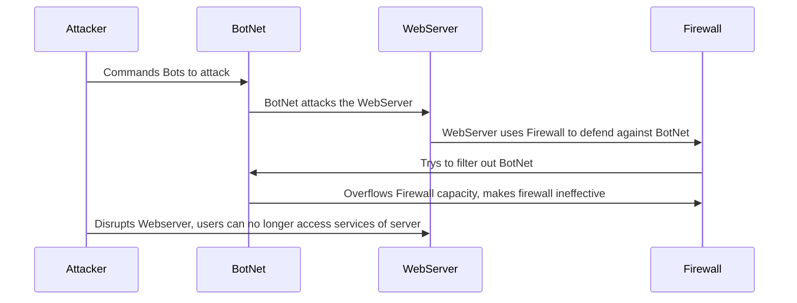

# -DDoS_Attack_Sequence.md.

In the diagram I show the steps it takes for an attacker to take down a server.

First the attacker initiates the DDoS attack by controlling a network of compromised devices. The devices usually have malware on them allowing the attacker to use it remotely. The Bots are individual devices such as computers, or other devices with internet access that have been infected and are under the control of the attacker. The attacker can then command these bots to send requests to the target server simultaneously. The target server is the system that the attacker wants to disrupt. In this case being the Webserver but it can also be a application, or any online service and the attacker goal is to make unavailable to users. Next up is the firewall which is a security system that monitors and controls incoming and outgoing network traffic based on predetermined security rules. Sometimes the firewall can filter out the malicious traffic. However, if the volume of requests exceeds its capacity, it can become ineffective. With the firewall failing to detect the bots the end result is that users cannot access the services of the Webserver due to the excessive load created by the bots.
